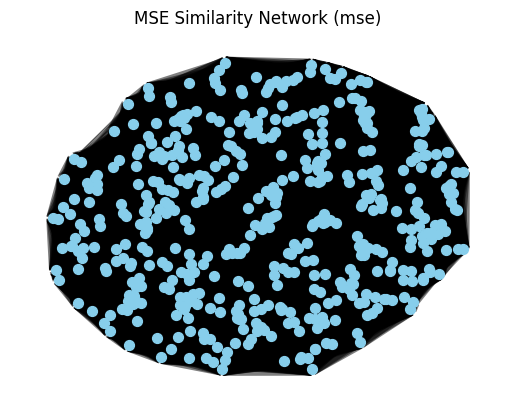
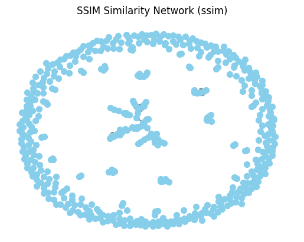

# Fractal Image Compression & Network Analysis

## Overview
This project implements **Fractal Image Compression** to achieve efficient image storage and reconstruction using **self-similarity properties**. It also visualizes the **structural relationships in images** using **network graphs** based on **MSE, SSIM, and Cosine Similarity metrics**.

The project was developed as part of a **Complex Systems and Networks course (EECE 7065)**, focusing on **image compression and network visualization techniques**.

## Key Features
- **Fractal-Based Image Compression** – Uses self-similarity to compress images.
- **MSE, SSIM, and Cosine Similarity Analysis** – Evaluates similarity between image patches.
- **Network-Based Image Visualization** – Converts compressed image data into graph structures.
- **High Compression Ratio** – Maintains quality with a **PSNR of 27.17 dB**.
- **Implemented in Python** – Uses **NumPy, OpenCV, NetworkX, Matplotlib, and Scikit-Image**.

---

## Folder Structure
```
Fractal-Compression-Network-Analysis
│── fractalimagecompression.py    # Main Python script
│── FinalReport_CSN.docx          # Project Report
│── requirements.txt              # Dependencies file
│── boy.png                       # Test image for compression
│── Results/                      # Stores output images & graphs
│    │── Cosine Similarity.png       # Cosine Similarity Network Graph
│    │── SSIM.png                    # SSIM Network Graph
│    │── MSE.png                     # MSE Network Graph
│    │── Original vs Decompressed.png # Comparison of images
│── README.md                      # Project documentation
```

---

## Theory Behind Fractal Image Compression
Fractal image compression exploits **self-similarity in images**, where different parts of an image resemble other parts at different scales. The algorithm:
1. **Partitions the image** into small blocks using **Quadtree decomposition**.
2. **Searches for similar blocks** within the image.
3. **Encodes transformations** (scaling, rotation, translation) to reconstruct the original image.
4. **Decodes the image iteratively**, refining the details at each step.

This technique achieves **high compression ratios while maintaining visual quality**.

---

## Installation & Setup
### Install Dependencies
First, install the required Python packages using:
```bash
pip install -r requirements.txt
```

### Run the Compression Script
Execute the main Python script to compress and visualize the image:
```bash
python fractalimagecompression.py
```

### Expected Output
- A **PSNR value** is printed in the terminal:
  ```
  PSNR between original and decompressed images: 27.17 dB
  ```
- Two images are displayed:
  - **Left:** Downsampled Original Image  
  - **Right:** Decompressed Image  
- **Three network graphs are generated**:
  - MSE Similarity Network
  - SSIM Similarity Network
  - Cosine Similarity Network

### Sample Output Images
#### Original vs Decompressed Image


#### MSE Similarity Network


#### SSIM Similarity Network


#### Cosine Similarity Network


---

## Project Report
A detailed analysis of this project, including the methodology and results, is available in **Fractal_Image_Compression.docx**.

---

## Future Improvements
- Implement **deep learning-based compression** (e.g., Autoencoders).
- Optimize similarity search using **KD-Trees** or **Locality-Sensitive Hashing (LSH)**.
- Extend to **video compression** using fractal methods.

---

## Applications
- **Image search & retrieval**  
- **Texture analysis & indexing**  
- **Self-similarity-based compression techniques**  

---

## Contributors
- **Apoorva Nandigama**
- **Lakshman Terli**
- **Supraja Byreddy**
- **Chiradeep Pasupuleti**

---

## License
This project is licensed under the **MIT License**.

---

## Connect & Reach Out
If you have any questions or suggestions, feel free to connect on **GitHub** or **LinkedIn**! 

**GitHub:** [Fractal-Compression-Network-Analysis](https://github.com/ApoorvaN1701/Fractal-Compression-Network-Analysis)  
**LinkedIn:** [Apoorva Nandigama](https://www.linkedin.com/in/apoorva-nandigama/)  

Happy Coding!

